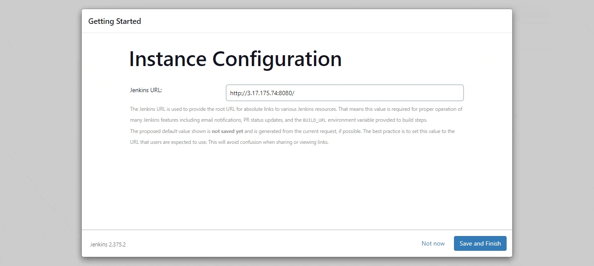

# JENKINS-> ANSIBLE CHALLENGE

Setup / configure a Jenkins instance on AWS
You already have your Ansible agent running and a EC2 machine that you can configure for Jenkins (Rename from JSHost to JenkinsHost)

You will need to have a GitHub repo with the following files:

- jenkins-config.yml
- inventory.txt
- README.md

Deliverables:

- Playbook for Jenkins
- To configure a Jenkins instance on AWS (Provide IP Address)
- Detailed README.md on how to use your Playbook.
- Screen recording of you playbook running and Jenkins working.

---

## Demo

### Installing Jenkins Using Ansible Playbook


---

### Post-installation Jenkins Setup



---

### Notes

#### Inventory.text

Specifies the host(s) for Ansible to manage and is also used in the execution of Ansible playbook. It has hostname and variables specific to the host (private key required to ssh into host).

#### jenkins-config.yml

The package cache is updated to ensure the latest packages are available. To secure the installation, a key file is imported from jenkins-ci. The jenkins repository is then added to the remote host. OpenJDK 11 is installed followed by Jenkins. Jenkins service is started to complete the setup process.

#### Playbook execution

This playbook makes it easy to install and configure Jenkins on a remote host. By using Ansible, one can automate the process and ensure that Jenkins is consistently set up the same way on all hosts. To execute the playbook, run the following command:

```
ansible-playbook -i inventory.txt jenkins-config.yml

```

---

#### Post-installation Jenkins Setup Steps

---

After installing Jenkins, a few additional steps need to be performed to get it up and running.

#### Accessing Jenkins

To access Jenkins, navigation to http://<jenkins public ip>:8080 in a web browser is required, replacing <jenkins public ip> with the public IP address of Jenkins instance.

#### Unlocking Jenkins

When first accessing Jenkins, one is prompted to unlock it. To do this, a step for retrieving the automatically-generated password is required.

SSH into Jenkins instance.

Using following command:

```

$ sudo cat /var/lib/jenkins/secrets/initialAdminPassword

```

#### Installing Plugins

Jenkins has a large number of plugins available, and the installation process is simplified with the "Install suggested plugins" option.

#### Creating the Admin User

Once the plugins is installed, one is prompted to create an admin user. Filled in the required information and clicked "Save and Finish".

#### Conclusion

By following these steps, anyone should be able to start using Jenkins to automate builds and deployments.

---
